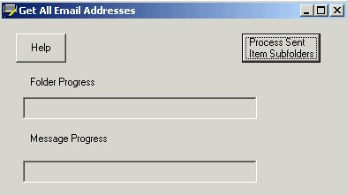

## Email address harvesting

### Description

Our support department handles roughly 300 emails a week that come into our mailbox in Outlook. Each details a problem of some sort and we respond with a resolution. In case there is a followup question, we've taken to creating a subfolder in outlook (by name of the company) and then just keep all the emails in that folder. From time to time, archive the old ones. As you can imagine, these tend to build up and if you don't keep on top of things, you might have a couple hundred of these to do. Of course, not everyone who emails us tells us their company so you have to figure out where they should be filed which takes additional time. Now, wouldn't it be nice if there was a program that could help us out?

As it turns out, there is now. This is the program (called simply Initial.exe) that will start in a specific folder and then all the subfolders for all the stored emails. It then will update a SQL database using DAO with the first email address on the list and the name of the folder that it belongs to. This in itself could be handy for creating a mass mailing list perhaps of people who have ever emailed you. The ultimate use for this, of course, is to have a program that would take all the email from specific folder (this was the sent-items folder), find the email address of the sender, locate the correct folder name in the SQL database to file it under, then move it automatically. There is some built in help, it uses the Genie character (wanted to play around with that a bit). This program was put together pretty quickly so isn't the prettiest and it hard coded here & there for our specific needs but should be fairly readable. It demonstrates the MAPI function library, Outlook functions, DAO & SQL, and MS Character use. This could very easily be switched to using an Access DB (by changing the connection string) which is actually what I tested it with before going "live". If this is useful to you, vote for it or just drop me a line. I know it has saved my department a ton of time.
 
### More Info
 
A DSN named OutookDB must be created. In the SQL database it points to, the name of the DB is OutlookDB with a table Contacts- fields CompanyName,Email,DisplayName. Make sure in the DSN Setup that use OutlookDB is marked as Default.

             |
---                |---
**Submitted On**   |2000-09-12 15:32:42
**By**             |[Patrick Roth](https://github.com/Planet-Source-Code/PSCIndex/blob/master/ByAuthor/patrick-roth.md)
**Level**          |Intermediate
**User Rating**    |4.8 (29 globes from 6 users)
**Compatibility**  |VB 5\.0, VB 6\.0
**Category**       |[Complete Applications](https://github.com/Planet-Source-Code/PSCIndex/blob/master/ByCategory/complete-applications__1-27.md)
**World**          |[Visual Basic](https://github.com/Planet-Source-Code/PSCIndex/blob/master/ByWorld/visual-basic.md)
**Archive File**   |[CODE\_UPLOAD1288012202000\.zip](https://github.com/Planet-Source-Code/patrick-roth-email-address-harvesting__1-13741/archive/master.zip)

